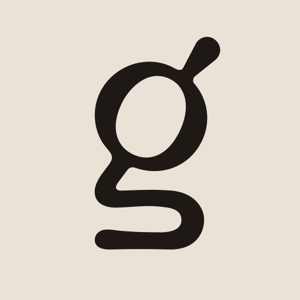

# trmnl-goodreads

A TRMNL Plugin for Goodreads. Show your Goodreads shelves with a large book cover on the left and metadata on the right.

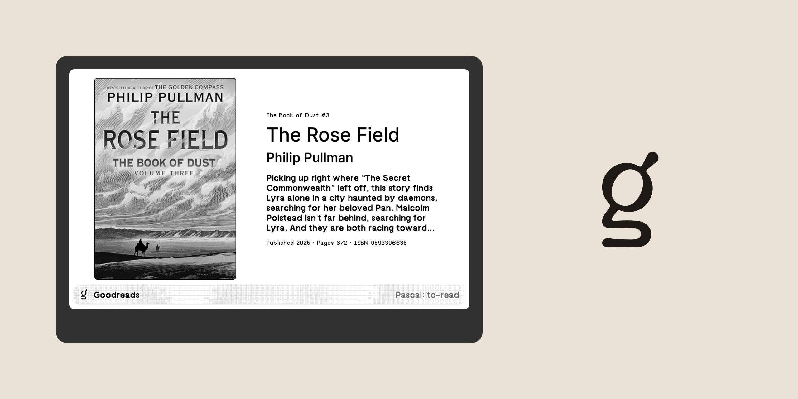

## Preview

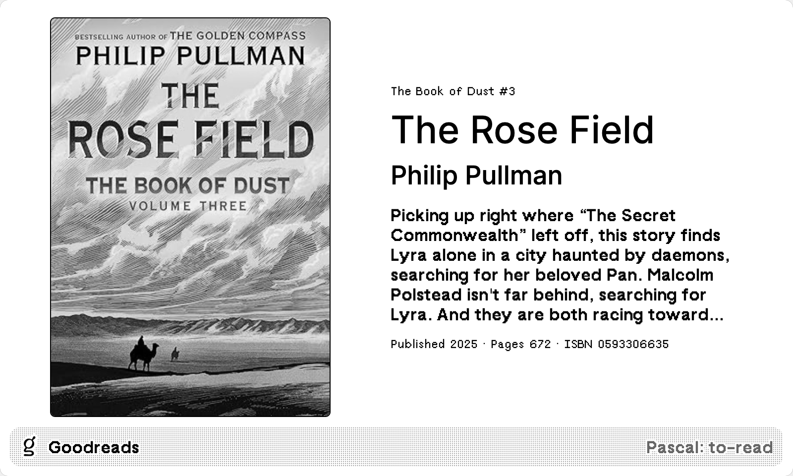

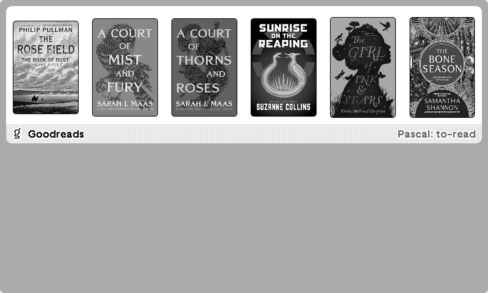

## Installation

## Development

1. Install Docker
2. Run trmnlp in the project root directory:

``` sh
./bin/trmnlp serve
```

## Previews (Light Mode)


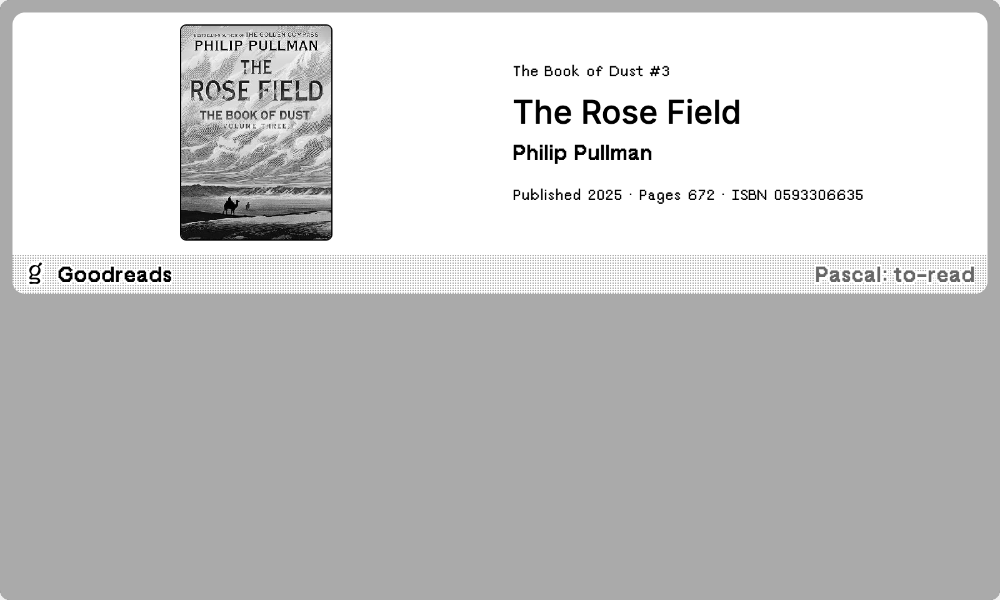
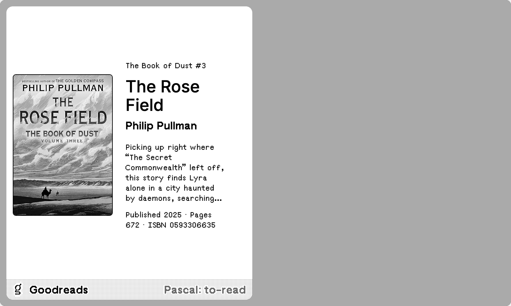
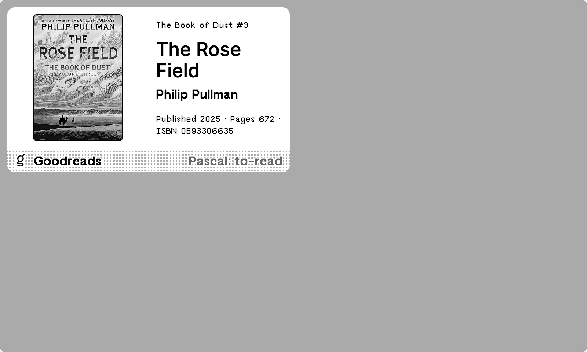

## Previews (Dark Mode)

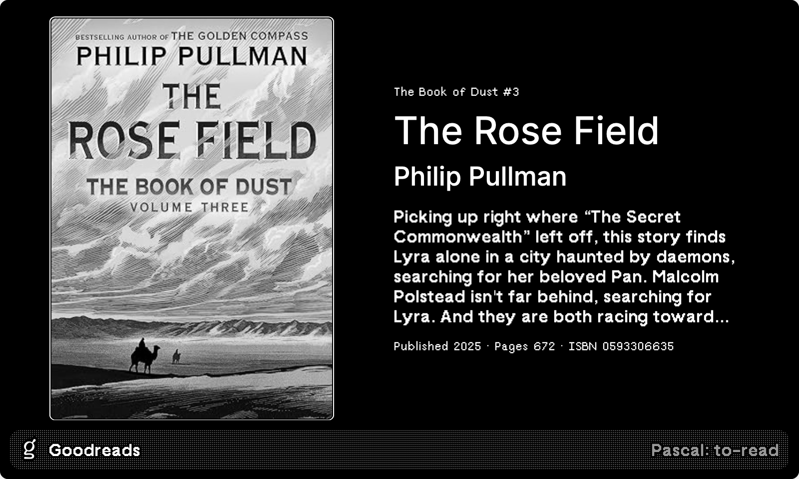
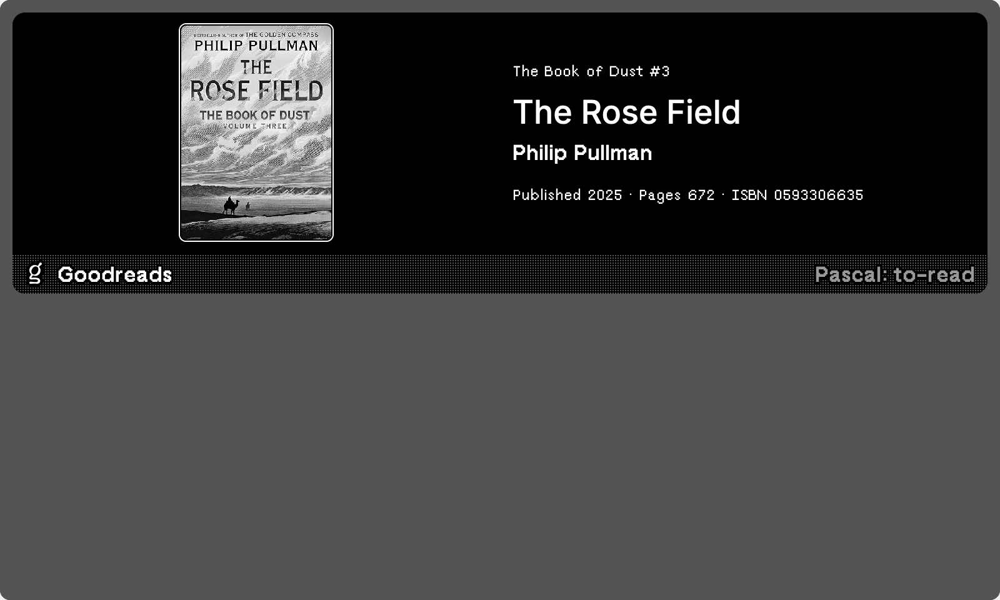
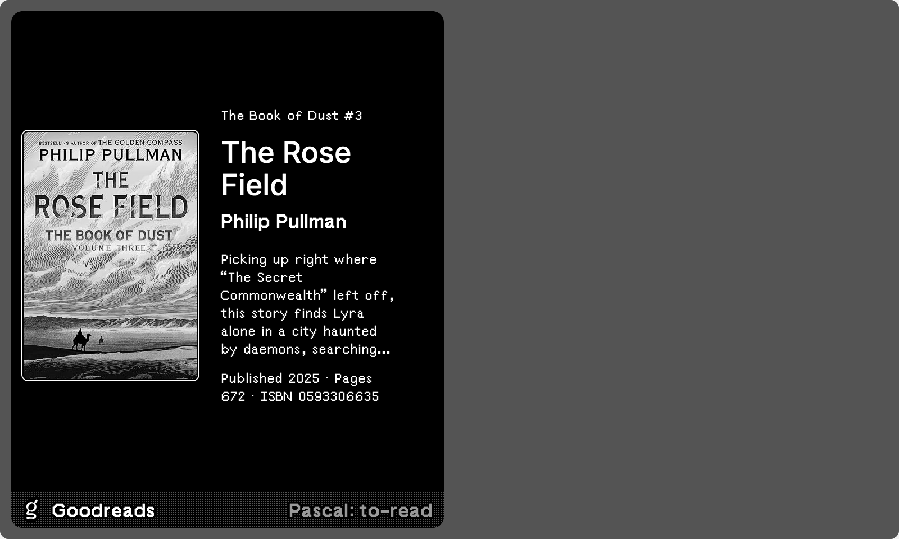
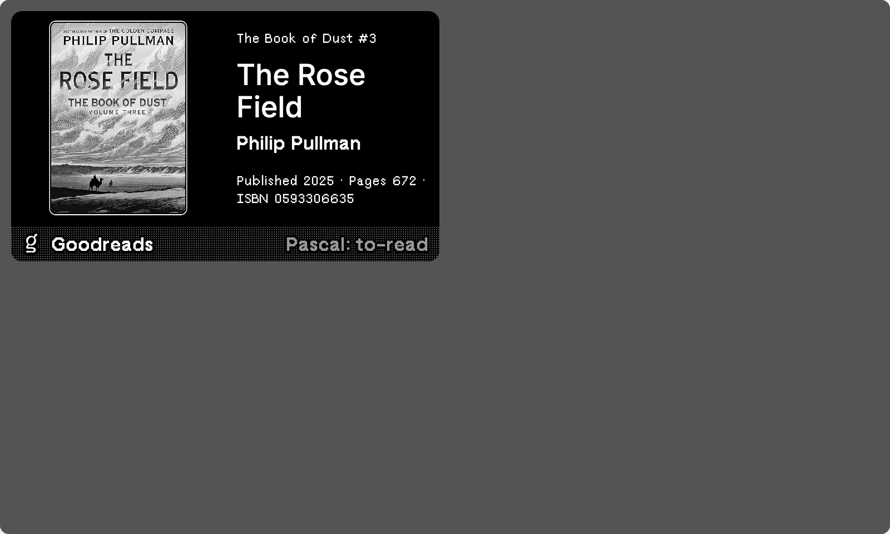

## License

This project is open source licensed under the BSD 3-Clause License. Please see the [LICENSE file](LICENSE) for more information.
